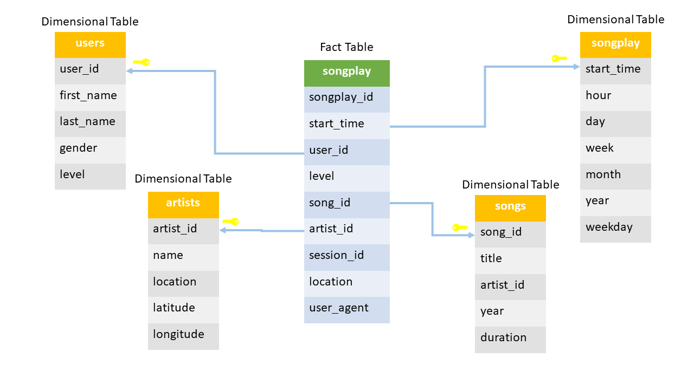

<h1>Project 5: Data Pipelines with Airflow</h1>

<h2>Project Description</h2>

In this project, a music streaming startup, Sparkify, has decided that it is time to introduce more automation and monitoring to their data warehouse ETL pipelines and come to the conclusion that the best tool to achieve this is Apache Airflow. They require a data engineer to create high grade data pipelines that are dynamic and built from reusable tasks, can be monitored, and allow easy backfills. They have also noted that the data quality plays a big part when analyses are executed on top the data warehouse and want to run tests against their datasets after the ETL steps have been executed to catch any discrepancies in the datasets.

There are two datasets, song data and log data, in the S3. The song dataset continue metadata about a song and the artist of that song. The log dataset consists of log files based on the songs in the song dataset.

<h2>The Analysis Schema</h2>

 
From song and log datasets you'll need to create a star schema optimized for queries on song play analysis. This includes the following tables.

Fact Table:

<ul>
<li>songplays - records in event data associated with song plays i.e. records with page NextSong</li>
</ul>

Dimension Tables:

    
<ul>
<li>users - users in the app</li>
<li>songs - songs in music database</li>
<li>artists - artists in music database</li>
<li>time - timestamps of records in songplays broken down into specific units</li>
</ul>

The figures below shows the schema and the DAG used to build the pipeline.

<h2>Project Components</h2>

The project consists of one dag and four operators:

The dag will manage the pipeline tasks and the operators will be used for staging the datasets to redshift, loading the fact and dimension tables, and perform data quality check on the created tables.

<h2>Running the Project</h2>

The project assume that you have a running Airflow instant and Redshift cluster. Make sure you add the redshift and IAM credential to Airflow.
In redshift, create the tables provided in create_tables.sql file before running the dag. Next, run the dag in Airflow.

